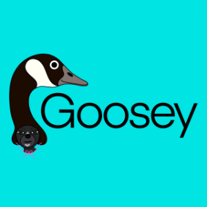

# Goosey

Goosey is a cribbage AI. It is full-featured, well-tested, and plays a strong game (although I have no practical way to quantify that). However, I believe there is ample room for improvement, so in that sense, it is still a work in progress. 

### License

The source code for this repo has been released under the [MIT License](LICENSE).

### Copyright

© 2022 Stephen E. Bensley

## Building from Source

Goosey was developed with [Xcode](https://developer.apple.com/xcode/), which is freely available from Apple. After installing Xcode and cloning the repo, open the Xcode [project](Goosey.xcodeproj) at the root of the repo. Check out the most recent tag to ensure a stable build.

The code is entirely standards-compliant C++17, so it should be easy to compile on other platforms.

### Dependencies

None.

### Targets

The Xcode project has the following targets:

- Static libraries:
    - BoardStrategy: Estimates the probability of the dealer winning the game from a given board position. 
    - CardPlayStrategy: Strategy for the pegging portion of a Cribbage game.
    - DiscardStrategy: Strategy for the discard portion of a Cribbage game.
    - GameModel: Core logic for playing a game of Cribbage.
    - Players: Various AIs for playing Cribbage.
- CopyDataFiles: Copies the various data files to the products directory.
- gen_file: Command-line tool that generates the various data files. Run without arguments to display usage.
- play_match: Command-line tool that play matches between various strategies. Run without arguments to display usage.
- run_tests: Unit tests implemented using [Catch2](https://github.com/catchorg/Catch2)
