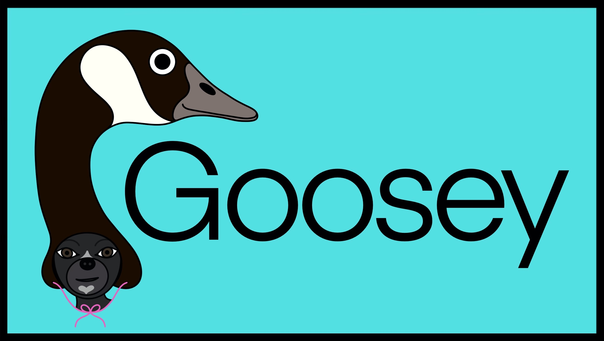

# Goosey

Goosey is a cribbage AI. It is full-featured, well-tested, and plays a strong game (although I have no practical way to quantify that).
However, I believe there is ample room for improvement, so in that sense, it is still a work in progress. Goosey was developed under
Xcode on MacOS, but the code is entirely standards-compliant C++17, so it should be easy to compile on other platforms.

Goosey is licensed under the MIT License. See the [LICENSE](LICENSE) file at the root of this repository for complete licensing information.
